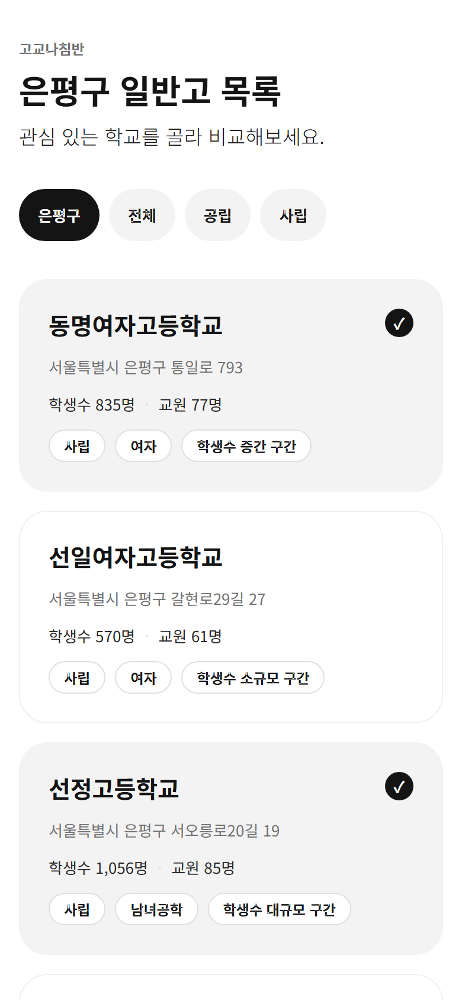
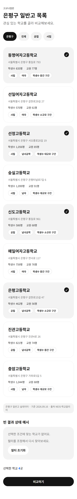
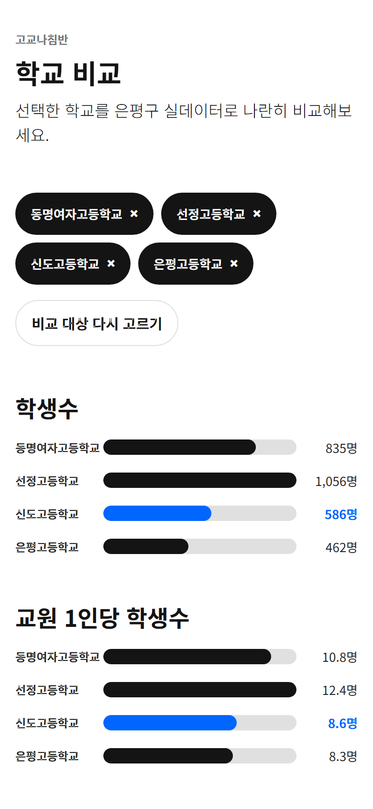
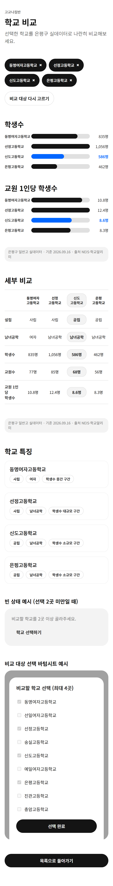
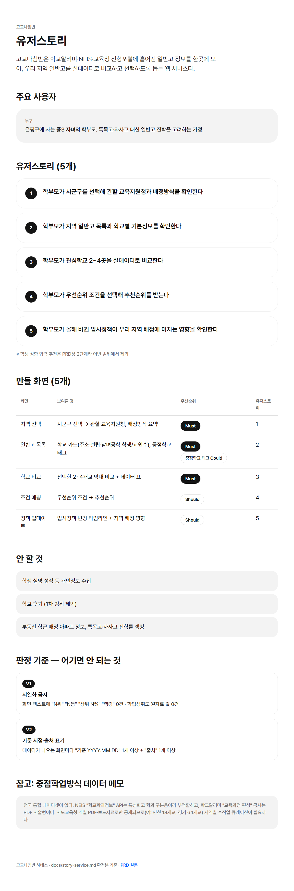

# 고교나침반 하네스 — 산출물 정리

> 작성 2026-10-07, 깃 반영 2026-10-08 · 기준 실행 `runs/20260930-1616` (화면: 학교 비교, 일반고 목록) · 이 문서는 사람이 읽는 정리본이다. 실행 현황 자동 요약은 `runs/INDEX.md`.

## 깃 저장소 (필수)

**https://github.com/soullim/my-harness** (브랜치 `main`)

| 바로가기 | 주소 |
|---|---|
| 저장소 | https://github.com/soullim/my-harness |
| 웹 미리보기 (GitHub Pages) | https://soullim.github.io/my-harness/ |
| 유저스토리 페이지 | https://soullim.github.io/my-harness/story.html |
| 시안 · 일반고 목록 | https://soullim.github.io/my-harness/runs/20260930-1616/03-drafts/list.html |
| 시안 · 학교 비교 | https://soullim.github.io/my-harness/runs/20260930-1616/03-drafts/compare.html |

## 1. 한눈에

- 하네스를 1회 돌려 **시안 2개**(일반고 목록, 학교 비교)를 만들었다. 둘 다 390×844 HTML이고, 서울 은평구 일반고 9곳 실데이터를 쓴다.
- 자동 판정(G1~G4) 전부 통과, **위반 0건**(V1 서열화 금지 · V2 기준 시점·출처 포함). 사람 승인 1회, 반려 0회.
- S5 공유는 **보류**했다. `rules/rules.json`의 `share.base_url`이 비어 있고, 이번 단계에서는 공유를 건너뛰고 유저스토리 HTML 업로드로 대신했다.

## 2. 산출물 — 스크린샷

390×844는 시안의 기준 프레임이다. 첫 화면은 그 크기로, 전체는 스크롤 끝까지 찍었다. (GitHub Pages에 올라간 페이지를 헤드리스 Edge로 캡처, 2배 해상도)

<table>
<tr>
<th>일반고 목록<br>첫 화면 390×844</th>
<th>일반고 목록<br>전체</th>
<th>학교 비교<br>첫 화면 390×844</th>
<th>학교 비교<br>전체</th>
</tr>
<tr>
<td valign="top"></td>
<td valign="top"></td>
<td valign="top"></td>
<td valign="top"></td>
</tr>
</table>

- **일반고 목록**: 필터 칩, 은평구 일반고 9곳 카드(선택 4곳 표시), 학교 속성·학생수 구간 태그, 하단 `기준 2026.09.16 · 출처 NEIS·학교알리미` 바, 빈 결과 상태 예시, "비교하기" 버튼.
- **학교 비교**: 선택한 4곳을 학생수·교원 1인당 학생수 막대로 비교(강조 학교 1곳만 파랑), 비교표, 학교 특징 태그, 같은 기준 시점·출처 바.

유저스토리 페이지(`story.html`)도 같은 디자인 기준으로 만들었다.



## 3. 산출물 — 파일

링크는 깃 저장소 `main` 기준이다(`https://github.com/soullim/my-harness/blob/main/…`).

| 구분 | 파일 | 내용 |
|---|---|---|
| 입력 | [PRD 문서](https://claude.ai/code/artifact/ed4218ed-72bc-4a26-8ed6-7545846b132d) · [PDF](https://github.com/soullim/my-harness/blob/main/docs/%EA%B3%A0%EA%B5%90%EB%82%98%EC%B9%A8%EB%B0%98%20PRD.pdf) | 제품 요구사항 |
| 입력 | [docs/story-service.md](https://github.com/soullim/my-harness/blob/main/docs/story-service.md) | 확정 유저스토리 5개, 만들 화면 5개, 안 할 것, V1·V2 |
| 입력 | [docs/school-design.md](https://github.com/soullim/my-harness/blob/main/docs/school-design.md) · [rules/rules.json](https://github.com/soullim/my-harness/blob/main/rules/rules.json) | 디자인 기준(사람용) · 판정 값(SSOT) |
| 입력 | [sample_data/eunpyeong_schools.json](https://github.com/soullim/my-harness/blob/main/sample_data/eunpyeong_schools.json) | 은평구 일반고 9곳 실데이터 (NEIS 기본정보 + 학교알리미 학생·교원수, 2026.09.16 조회) |
| S1 리서치 | [01-research/references.md](https://github.com/soullim/my-harness/blob/main/runs/20260930-1616/01-research/references.md) | 화면당 레퍼런스 3건, 가져올 것·버릴 것 |
| S2 설계 | [02-spec/compare.md](https://github.com/soullim/my-harness/blob/main/runs/20260930-1616/02-spec/compare.md) · [list.md](https://github.com/soullim/my-harness/blob/main/runs/20260930-1616/02-spec/list.md) | 목적 · 주요 요소 · 연결 유저스토리 |
| S3 시안 | [03-drafts/compare.html](https://github.com/soullim/my-harness/blob/main/runs/20260930-1616/03-drafts/compare.html) · [list.html](https://github.com/soullim/my-harness/blob/main/runs/20260930-1616/03-drafts/list.html) | 390×844 HTML 시안 |
| S4 판정 | [04-verdict/violations.json](https://github.com/soullim/my-harness/blob/main/runs/20260930-1616/04-verdict/violations.json) · [report.md](https://github.com/soullim/my-harness/blob/main/runs/20260930-1616/04-verdict/report.md) | 위반 목록(`[]` = 0건) · 사람용 요약 |
| 기록 | [run.json](https://github.com/soullim/my-harness/blob/main/runs/20260930-1616/run.json) | 단계·재시도·승인·이력 |
| 별도 | [story.html](https://github.com/soullim/my-harness/blob/main/story.html) | 유저스토리 페이지 |
| 스크린샷 | `deliverables/screenshots/` 5장 | 위 2절 |

## 4. 진행방식

### 4.1 전체 흐름

```
PRD → 유저스토리 확정 → 디자인 기준·판정 값 확정 → 하네스 설계 → 실행(S1~S5) → 산출물 정리 → 깃 업로드
```

1. **입력 확정**: PRD에서 유저스토리 5개와 "어기면 안 되는 것"(V1 서열화 금지, V2 기준 시점·출처)을 뽑아 `docs/story-service.md`로 확정했다. PRD에 없는 내용은 넣지 않는다는 규칙을 썼다.
2. **기준 확정**: 디자인 시스템은 `docs/school-design.md`, 스크립트가 판정하는 값은 `rules/rules.json` 한 파일(SSOT)로 모았다. 둘이 다르면 `rules.json`이 우선한다.
3. **하네스 설계**: 오케스트레이터(메인 세션)가 에이전트를 부르고, 단계마다 게이트 스크립트로 통과를 판정한다. 에이전트의 "완료"라는 말은 판정이 아니다.
4. **실행**: 아래 단계표대로 진행하고, 시안이 통과한 뒤 사람이 승인한다.

### 4.2 단계와 게이트

| 단계 | 담당 | 편집 폴더 | 산출물 | 게이트 통과 조건 |
|---|---|---|---|---|
| S1 리서치 | researcher | `01-research/` | `references.md` | G1: 화면별 섹션 수 = 화면 수, 섹션마다 링크 있는 레퍼런스 3건 이상 |
| S2 설계 | planner | `02-spec/` | `<약어>.md` | G2: 파일 수 = 화면 수, 제목 "목적" "주요 요소" "연결 유저스토리" |
| S3 시안 | designer | `03-drafts/` | `<약어>.html` | G3: 390×844 프레임, `<style>` 1개, 인라인 style 금지 |
| S4 판정 | judge | 없음(읽기 전용) | `violations.json` | G4: 색·타이포·간격·라운드·그림자·이모지·액센트 규칙 + V1·V2 위반 합계 0 |
| 사람 승인 | 본인 | — | run.json `approved` | "승인" 또는 "반려: 사유" (반려 시 S3로 복귀) |
| S5 공유 | sharer | `05-share/` | `share-urls.txt` | G5: 줄 수 = 시안 수, `시안 A — https://…` 형식 |

- 실패 복귀: G1~G3는 같은 단계 1회, G4는 S3로 최대 2회, 반려는 최대 2회. 초과하면 `stopped`로 멈추고 사람이 확인한다.
- 판정은 정적 검사(HTML·CSS 텍스트에서 값을 직접 추출)다. 브라우저 렌더링을 보지 않으므로 시각 품질은 승인 단계에서 사람이 본다.
- 이전 실행 결과는 덮어쓰거나 지우지 않는다.

### 4.3 이번 실행 타임라인 (2026-09-30)

| 시각 | 사건 | 결과 |
|---|---|---|
| 16:16 | `run_state.py new "학교 비교" "일반고 목록"` | 실행 폴더·run.json 생성, 화면 `compare`, `list` |
| ~16:21 | S1 researcher → G1 | 통과 (화면당 레퍼런스 3건) |
| ~16:22 | S2 planner → G2 | 통과 (설계 문서 2개) |
| ~16:31 | S3 designer → G3 | 통과 (시안 2개) |
| ~16:31 | S4 `check_design.py` → G4 | 통과, 위반 0건 |
| 16:34 | 사람 승인 | 승인 (G4 재시도 0, 반려 0) |
| 16:35 | S5 sharer → G5 | 실패 기록: `share.base_url` 비어 있어 `share-urls.txt` 미작성 → 공유 보류 |
| 16:41 | 깃 업로드 | `story.html` (커밋 b46dfd3) |
| 16:42 | 깃 업로드 | `runs/20260930-1616/` 8개 파일 (커밋 e5b5019) |
| 16:56 | 사용자가 웹에서 업로드 | 하네스 폴더 전체(커밋 25d9550) |

S1~S4 단계 전환 시각은 `run.json` 이력의 기록 시각이다(분 단위).

### 4.4 게이트 결과

| 게이트 | 결과 | 비고 |
|---|---|---|
| G1 리서치 | 통과 | compare: iM뱅크·하나원큐·신한 슈퍼SOL, list: 쏘카·컴포즈·네이버플러스. 부동산 학군·진학률 랭킹류는 "안 할 것"이라 제외 |
| G2 설계 | 통과 | |
| G3 시안 | 통과 | |
| G4 판정 | 통과 | 위반 0건 (V1·V2 포함) |
| 사람 승인 | 승인 | 1회 |
| G5 공유 | 미통과(보류) | `share.base_url` 미설정. 이번 단계에서는 공유를 건너뜀 |

## 5. 이번 실행에서 실제로 달랐던 점

설계 문서대로가 아니라 환경 사정으로 다르게 간 부분이다.

1. **Python 설치**: 이 PC에 Python이 없어서(Windows Store 스텁뿐) 사용자 요청으로 winget으로 3.12.10을 설치했다.
2. **`.claude/` 설치 미실행**: `scripts/install_claude_setup.py`는 Claude Code 자체 설정(hook·에이전트 정의)을 쓰는 스크립트라 자동모드 분류기가 자기설정 변경으로 막았다. 우회하지 않았고, 이 문서 작성 시점에도 로컬에 `.claude/`가 없다.
3. **에이전트 호출 방식 대체**: 에이전트 5종이 정식 서브에이전트로 등록되지 않아, researcher·planner·designer·sharer는 범용 에이전트에 `_claude-setup/agents/*.md`의 프롬프트를 그대로 넣어 호출했다. judge는 하는 일이 `check_design.py` 실행뿐이라 오케스트레이터가 직접 실행했다.
4. **폴더 밖 쓰기 차단 hook도 미적용**: 대신 researcher·planner·designer 실행 직후마다 파일 수정 시각으로 편집 폴더 밖 변경이 없는지 확인했고, 세 번 모두 0건이었다(sharer는 파일을 쓰지 않고 멈춰서 따로 확인하지 않았다). hook 같은 사전 차단이 아니라 사후 점검이다.
5. **GitHub Pages**: 처음엔 꺼져 있어 `story.html` 주소가 404였고, GitHub API로 Pages를 켜서(`main` 브랜치, 루트) 지금은 모든 주소가 200으로 열린다.

## 6. 알려진 한계 · 확인이 필요한 것

- **학생수 구간 경계값이 정의돼 있지 않다.** PRD·`rules.json` 어디에도 소·중·대 기준이 없다. 시안에서 설계자가 3·3·3으로 나눴다: 소규모(462·570·586명), 중간(759·821·835명), 대규모(1,044·1,056·1,099명). 경계값은 확정이 필요하다.
- **비교 화면의 강조 학교(신도고)는 시안용 예시**다. 실서비스에서는 사용자가 고른 학교 1곳이 되어야 한다.
- **데이터 범위**: 기본정보는 NEIS, 학생수·교원수는 학교알리미 공시 페이지에서 가져왔고 조회일(2026.09.16)에 따라 소폭 달라질 수 있다. 학급수·진학·전출입·선택과목 등은 이번 시안에 없다(PRD 데이터 요구사항, `README.md` 참고).
- **화면 5개 중 2개만** 만들었다. 지역 선택, 조건 매칭, 정책 업데이트는 아직이다.
- 시안 수치는 위 데이터 그대로이고, 고치지 않았다.

## 7. 다시 실행하는 방법

채팅에서 (이 폴더 기준, `CLAUDE.md`의 트리거 표를 따른다):

| 말하면 | 동작 |
|---|---|
| "고교나침반 시안 만들어줘: 화면 2~3개" | 새 실행 폴더를 만들고 S1부터 |
| "이어서 해줘" | 가장 최근 실행의 `run.json` 단계부터 재개 |
| "승인" / "반려: 사유" | 사람 승인 지점 |
| "산출물 정리해줘" | `runs/INDEX.md` 갱신 + 실행별 상태·남은 일 요약 |

터미널에서 직접 실행하면:

```bash
python scripts/run_state.py new "학교 비교" "일반고 목록"   # 실행 폴더 생성
python scripts/gate.py G1 runs/<실행>                       # 단계마다 G1~G5
python scripts/check_design.py runs/<실행>                  # S4 판정
python scripts/organize_outputs.py                          # 산출물 정리
python scripts/selftest.py && python scripts/doccheck.py    # 하네스 자체 점검
```

## 8. 로컬과 깃 저장소의 차이 (2026-10-08 업로드 후)

| 구분 | 항목 | 상태 |
|---|---|---|
| 깃과 로컬 동일 | `runs/20260930-1616/`, `runs/INDEX.md`, 하네스 문서·스크립트(`organize_outputs.py`, `CLAUDE.md` "산출물 정리" 절 포함), `deliverables/` | 2026-10-08 업로드로 반영 |
| 깃에만 있음 | `story.html` | 로컬 프로젝트 폴더에는 없음 |
| 깃에 남아 있음 | `default-design.md`, `default-output.md` | 로컬에서는 `docs/`가 최종본이라 삭제했지만 깃에서는 지우지 않았다 |
| 깃에 불필요하게 있음 | `scripts/__pycache__/*.pyc` 2개 | 캐시 파일, 지우지 않았다 |
| 로컬에만 있음 | 루트의 `고교나침반 PRD.pdf` | `docs/` 안의 PDF와 내용이 같은 중복본이라 올리지 않았다 |

## 9. 다음 할 일

1. 깃에 남아 있는 `default-*.md`와 `__pycache__`를 지울지 결정.
2. S5 공유: 공유할 거라면 `rules/rules.json`의 `share.base_url` 값을 정한다(예: `https://soullim.github.io/my-harness/runs/` 형태). 이번 단계는 건너뛰었으므로 급하지 않다.
3. 학생수 구간 경계값 확정.
4. 남은 화면 3개(지역 선택, 조건 매칭, 정책 업데이트) 시안.
5. `.claude/` 설치는 본인이 직접 실행(`python scripts/install_claude_setup.py`)해야 정식 에이전트·hook이 적용된다.
